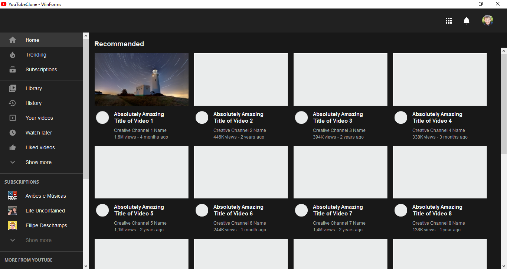
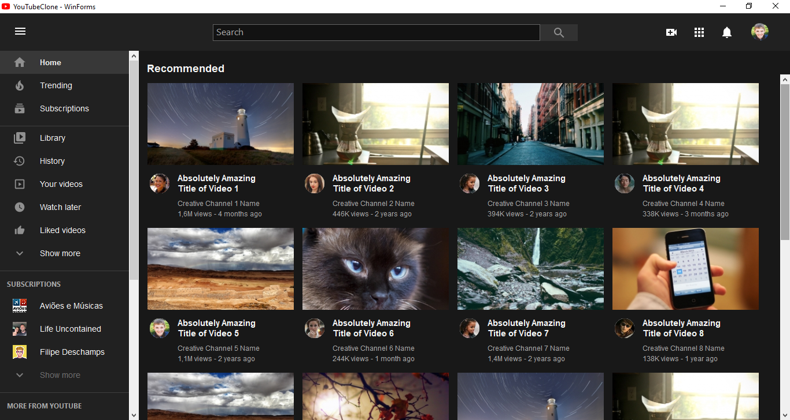
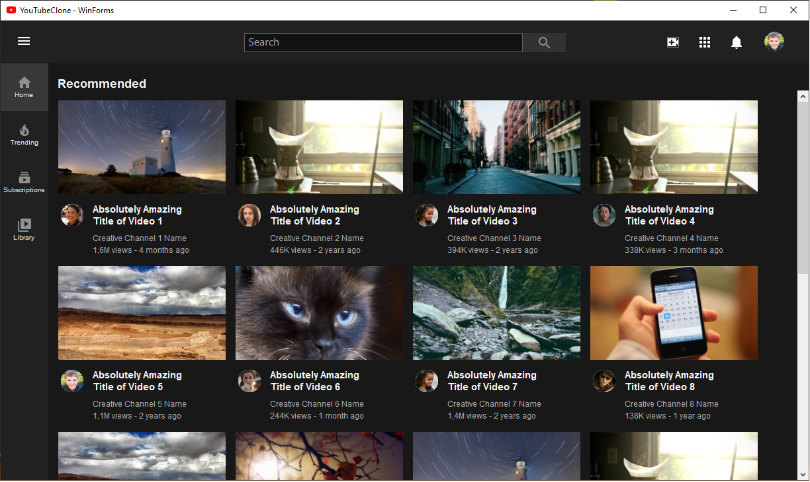

# youtube-clone-winforms
A clone of YouTube Home Page interface in good old Windows Forms 

### Prerequisites
- Visual Studio 2017
- .Net Framework 4.7.1

### Why?
I've been working with WinForms for many years, but generally there aren't much beautiful designed screens made with it.
So I took this just to challenge myself.

### Features
- Use of components and user controls
- Dark theme
- Async form loading
- Emulated skeleton loading cards

### Screenshots

